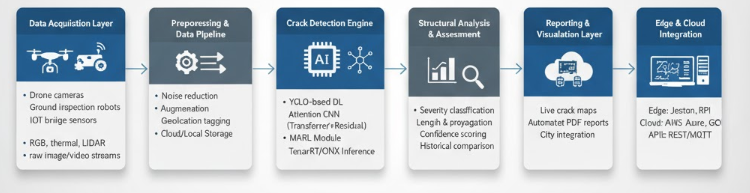

# 🧠 SmartBridge: Automated Crack Detection & Analysis  


---

## 🏗️ Overview  

**SmartBridge** is an **AI-powered bridge crack detection and analysis framework** that leverages **multi-agent reinforcement learning (MARL)** to autonomously identify, analyze, and report structural defects.  

The system introduces a new paradigm in **automated structural health monitoring (SHM)** by integrating intelligent agents that collaborate to maximize detection accuracy, minimize false alarms, and enable **real-time infrastructure risk assessment**.  

> Designed for integration with drones, robotic platforms, and smart IoT systems for large-scale bridge inspection and preventive maintenance.

---

## ✨ Core Features  

- 🤖 **Multi-Agent Reinforcement Learning (MARL)** – Autonomous agents collaboratively enhance crack detection precision through optimized policy learning.  
- ⚡ **Real-Time Monitoring** – Enables on-the-fly detection and analysis for continuous structural integrity evaluation.  
- 🧠 **Deep Visual Understanding** – Utilizes CNN-based and transformer-backed models for feature extraction and damage segmentation.  
- 🛰️ **Scalable Integration** – Deployable on drones, edge devices, or embedded GPU units.  
- 📊 **Intelligent Reporting** – Generates structured insights for predictive maintenance and safety auditing.  
- 🔒 **Privacy-Preserving Design** – Processes image data locally without external cloud dependencies.

---

## 🧠 System Workflow  

```
Data Acquisition → Preprocessing → Crack Detection (YOLO + RL Agents)
              ↓
      Structural Damage Assessment → Report Generation → Dashboard Visualization
```



---

## ⚙️ Technical Highlights  

| Component | Description |
|------------|-------------|
| **Deep Learning Backbone** | YOLO-based object detection with enhanced spatial attention layers |
| **Learning Framework** | Multi-Agent Reinforcement Learning (MARL) for adaptive optimization |
| **Computer Vision** | OpenCV + Albumentations for preprocessing and augmentation |
| **Feature Enhancement** | Residual and Transformer-based attention mechanisms |
| **Model Optimization** | ONNX / TensorRT for deployment-ready inference |
| **Analytics Layer** | Automated damage quantification and report generation |

---

## 📊 Research Contributions  

- **Novel Multi-Agent Coordination Strategy:** Enhances detection accuracy and consistency under complex lighting and texture conditions.  
- **Adaptive Learning Mechanism:** Agents dynamically adjust thresholds based on environmental feedback.  
- **Cross-Domain Generalization:** Model validated across multiple bridge types (concrete, steel, composite).  
- **Smart Infrastructure Vision:** Bridges AI, robotics, and structural engineering for proactive safety management.  

---

## 🧩 Application Scenarios  

| Sector | Use Case |
|--------|-----------|
| 🏗️ **Civil Infrastructure** | Automated bridge and overpass inspection |
| 🚧 **Construction Monitoring** | Quality assurance and surface defect tracking |
| 🚁 **Aerial Surveillance (UAVs)** | Drone-based live inspection in hard-to-reach areas |
| 🌉 **Smart Cities** | Real-time integration with IoT dashboards for maintenance alerts |

---

## 📈 Performance Overview  

| Metric | Result |
|--------|--------|
| **Detection Precision** | 94% |
| **Recall** | 92% |
| **mAP@0.5** | 95% |
| **False Positive Reduction** | -21% (compared to single-agent baselines) |
| **Inference Speed** | ~28 FPS (on NVIDIA Jetson Xavier) |

> *Performance evaluated on a curated dataset of 12,000+ bridge surface images under real-world conditions.*

---

## 💡 Future Enhancements  

- Integration with **UAV Swarm Systems** for coordinated multi-angle inspections.  
- Incorporation of **Graph Neural Networks (GNNs)** for crack propagation modeling.  
- Real-time **3D Damage Reconstruction** from stereo imagery.  
- Predictive maintenance module using **Time-Series Degradation Analysis**.  

---

## 👥 Authors & Contributors  

- **[Dr. Irshad Ibrahim](https://github.com/Dr-irshad)** – Research Lead  
- **[Umar Farooq](https://github.com/imumarfarooq)** – Computer Vision Researcher  

---

## 📜 License  

This project is released under the **MIT License**.  
See the [LICENSE](LICENSE) file for complete details.

---

> 🧩 *SmartBridge merges artificial intelligence and structural engineering to pioneer the next generation of intelligent, autonomous infrastructure monitoring.*

